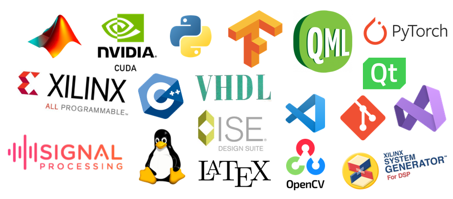

<h1 align="center"> Hi there 👋 I'm <a href='https://mhshammakhi.github.io/'>Mohammad Shammakhi </a></h1>

 <a>
  <a href="https://mhshammakhi.github.io">Website</a> •
  <a href="https://www.linkedin.com/in/mohammad-hasan-shammakhi-a6a34663/">Linkedin</a> •

I'm a Telecommunication Engineer with a great passion for exploring different fields that bring immense value. Let me break down my interests into three exciting areas:

Signal Processing and Communication Engineering:
One of my main areas of expertise lies in signal processing and communication engineering. I love diving into projects that involve developing innovative communication systems. To bring my ideas to life, I rely on powerful tools like MATLAB and Python. These languages enable me to work with complex signals, enhance their quality, and optimize overall system performance.

Software and Hardware Development:
I'm also a software and hardware enthusiast. I enjoy getting my hands dirty in the world of development, using languages like C++ and Qt to create awesome desktop applications. Additionally, I have experience in CUDA for GPU programming, which allows me to harness the full potential of graphics processing. When it comes to hardware development, I'm comfortable working with SystemGenerator and VHDL for FPGA projects. It's amazing how these skills enable me to bring software and hardware together for seamless solutions.

Machine Learning and Deep Learning:
Ah, Machine Learning and Deep Learning! This field excites me, especially when applied to image processing, computer vision, and signal processing. Python and MATLAB are my go-to tools for exploring these domains. I love developing smart algorithms that can extract valuable insights from complex data. It's incredible how these techniques can push the boundaries of what's possible and open up new avenues of innovation.

By the way, I should mention that I'm also skilled in Git, which has played a significant role in shaping my abilities and bringing me to where I am today. :smile:

  
* 💼 Currently I am newcomer of Canada and seeking for a new job 
* ✍🏻 I wrote dev articles on [Hashnode](https://lymcode.hashnode.dev)  
* 📫 Contact me [@MHShammakhi]([https://www.linkedin.com/in/](https://www.linkedin.com/in/mohammad-hasan-shammakhi-a6a34663/])

## My skills

  

  
## 🌐Socials

 
  
<!--
**mhshammakhi/mhshammakhi** is a ✨ _special_ ✨ repository because its `README.md` (this file) appears on your GitHub profile.

Here are some ideas to get you started:

- 🔭 I’m currently working on ...
- 🌱 I’m currently learning ...
- 👯 I’m looking to collaborate on ...
- 🤔 I’m looking for help with ...
- 💬 Ask me about ...
- 📫 How to reach me: ...
- 😄 Pronouns: ...
- ⚡ Fun fact: ...
-->

