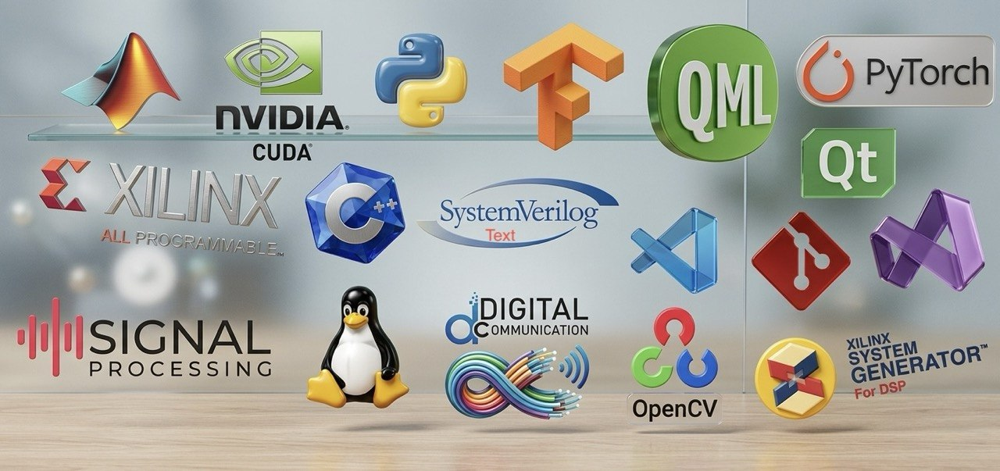

<h1 align="center"> Hi there 👋 I'm <a href='https://mhshammakhi.github.io/'>Mohammad Shammakhi </a></h1>

 <a>
  <a href="https://mhshammakhi.github.io">Website</a> •
  <a href="https://www.linkedin.com/in/mohammad-hasan-shammakhi-a6a34663/">Linkedin</a> •

## 👋 About Me
Applied R&D Engineer specializing in AI-driven communication systems, signal processing, and high-performance SW/HW co-design.

Currently developing a large-scale real-time system using Go, CUDA, and C++, focused on high-performance signal processing and system integration.

---

## 📡 Signal Processing & Communication Systems
Specialized in the design and development of advanced communication systems, with strong experience in signal modeling, filtering, and performance optimization.  
Work primarily involves MATLAB and Python for simulation, analysis, and algorithm development.

---

## 🤖 Machine Learning & Deep Learning
Applying machine learning to signal processing, communication systems, and computer vision.  
Experience includes feature extraction, nonlinear modeling, and data-driven optimization for complex systems.

---

## ⚙️ Software & Hardware Co-Design
Experienced in building high-performance systems across software and hardware layers:

- C++ / Qt for application development  
- CUDA for GPU-accelerated computation  
- FPGA development using VHDL and Xilinx System Generator  

Focused on bridging algorithm design with efficient real-time implementation.

---

## 🔬 Research Interests
- AI for Communication Systems  
- Feature extraction and representation learning  
- Real-time high-performance signal processing  
- ML-assisted Optical network modeling and optimization

---

## 💼 Current Role
Wireless System Researcher & Developer — Vancouver, Canada  

---

## 🤝 Contact
📫 Contact me:   

## My skills

  

  
 

## 🌐Socials
 
  
<!--
**mhshammakhi/mhshammakhi** is a ✨ _special_ ✨ repository because its `README.md` (this file) appears on your GitHub profile.

Here are some ideas to get you started:

- 🔭 I’m currently working on ...
- 🌱 I’m currently learning ...
- 👯 I’m looking to collaborate on ...
- 🤔 I’m looking for help with ...
- 💬 Ask me about ...
- 📫 How to reach me: ...
- 😄 Pronouns: ...
- ⚡ Fun fact: ...
-->

